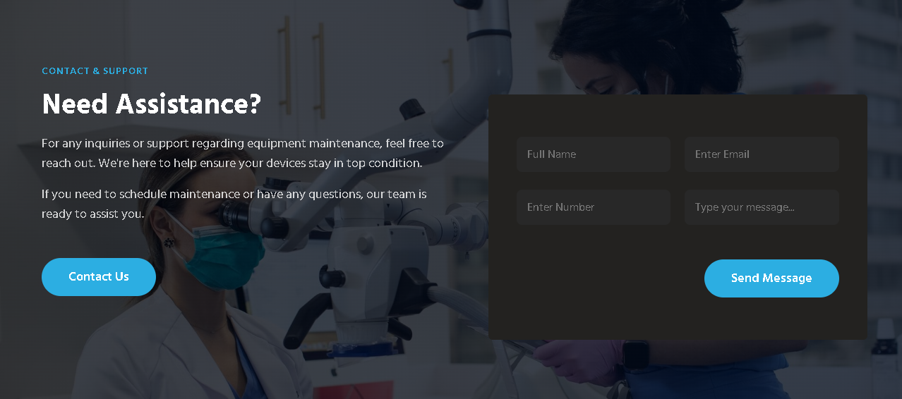

# BioMedical IQ Landing Page

**Ensure Equipment. Enhance Care.**

BioMedical IQ is a web-based platform designed to help healthcare facilities efficiently manage their medical equipment. The current landing page outlines our key features, services, and user testimonials. We are now expanding this project with the addition of **Contact Us**, **About Us**, and **Services** pages.

Live URL: [https://biomedicaliq.vercel.app/](https://biomedicaliq.vercel.app/)  
GitHub Repository: [https://github.com/kenzycodex/biomedicaliq](https://github.com/kenzycodex/biomedicaliq)

---

## Table of Contents

1. [Project Overview](#project-overview)
2. [Screenshots](#screenshots)
3. [Developer Guidelines](#developer-guidelines)
    - [Cloning the Repository](#cloning-the-repository)
    - [Creating New Pages](#creating-new-pages)
    - [Contribution Process](#contribution-process)
4. [Designer Guidelines](#designer-guidelines)
    - [Design Tools](#design-tools)
    - [Designing New Pages](#designing-new-pages)
    - [Submitting Designs](#submitting-designs)
5. [Contributing](#contributing)

---

## Project Overview

BioMedical IQ is a platform that offers hospitals and medical centers solutions for equipment management and maintenance. The landing page is the starting point for users and highlights our core services and value propositions.

We are expanding the platform by adding **About Us**, **Contact Us**, and **Services** pages. The aim is to ensure consistency across all pages by following the design patterns from the existing landing page.

---

## Screenshots

Below are some key sections of the landing page:

- **Hero Section**
  
  
  
- **Core Services**
  
  
  
- **About Us Section**
  
  

- **Testimonial Section**
  
  

- **Conatct Us Section**
  
  

You can find all screenshots in the repository under the `assets/images/sections/` directory or [Google Drive link here](https://drive.google.com/drive/folders/1n5U_Ocx4Sbl9UmrnMl4G8Tujoc-RSDCD?usp=drive_link).

---

## Developer Guidelines

This project is purely based on **HTML** and **CSS**. Follow these steps to clone the project, create new pages, and link them to the navigation bars on the landing page.

### Cloning the Repository

1. Fork the repository from GitHub:  
   [https://github.com/kenzycodex/biomedicaliq](https://github.com/kenzycodex/biomedicaliq)
   
2. Clone your forked repository locally:
    ```bash
    git clone https://github.com/<your-username>/biomedicaliq.git
    cd biomedicaliq
    ```

### Creating New Pages

We need additional pages: **About Us**, **Contact Us**, and **Services**. To create these pages:

1. **Create a new branch** to work on the new pages:
    ```bash
    git checkout -b my-contribution
    ```

2. **Create the HTML files**:
   - Use the existing design in `index.html` as a reference for the style, layout, and color scheme.
   - Create new files `about.html`, `contact.html`, and `services.html` in the root directory.
   - Update the navigation bar in `index.html` to link to these new pages:
     ```html
     <nav>
        <ul>
           <li><a href="index.html">Home</a></li>
           <li><a href="about.html">About Us</a></li>
           <li><a href="services.html">Services</a></li>
           <li><a href="contact.html">Contact</a></li>
        </ul>
     </nav>
     ```

3. **Follow the same design principles** as the landing page (e.g., consistent fonts, color schemes, and layouts).

4. **Commit your changes** regularly as you complete small tasks.

    ```bash
    git add .
    git commit -m "Added About Us page structure"
    ```

5. **Push your branch** to your forked repository:
    ```bash
    git push origin my-contribution
    ```

### Contribution Process

1. Fork the repository (as shown in the cloning steps).
2. Work on your own branch by adding pages and making changes.
3. Once you've made progress (even if it's small), push your branch.
4. Create a pull request (PR) to the main repository.

    - Go to your forked repository on GitHub.
    - Click on **Compare & pull request**.
    - Submit a PR to merge your feature branch into the `main` branch of the original repository.
    - Make sure to add clear descriptions in the PR explaining the changes.

5. **Repeat this process for every small change**. This ensures a consistent review process and avoids large, unmanageable PRs.

---

## Designer Guidelines

Designers will contribute by creating the designs for **About Us**, **Contact Us**, and **Services** pages, similar to the landing page’s design. Use tools like Figma, Canva, or Adobe XD to create these designs.

### Design Tools

- **Figma** (preferred for collaboration)  
- **Adobe XD**  
- **Canva**  

If you don’t have access to some assets like images, you can download them from [Google Drive link here](https://drive.google.com/drive/folders/1n5U_Ocx4Sbl9UmrnMl4G8Tujoc-RSDCD?usp=drive_link).

### Designing New Pages

The design for the **About Us**, **Contact Us**, and **Services** pages should follow the same theme as the landing page:

- **Consistent color scheme**: Use the same colors as on the landing page.
- **Font and typography**: Keep the fonts and text hierarchy consistent.
- **Layout**: Keep similar spacing, layout structures, and design elements to ensure a unified experience across all pages.

### Submitting Designs

1. Once you complete a design or a part of it, export the design files (as `.png`, `.jpg`, or `.pdf`) or share a Figma/Canva link for review.
2. Create a new branch in the repository for your designs and submit them:
    ```bash
    git checkout -b feature/designs-contact-services-about
    ```
3. Push your designs or exported files into an appropriate folder (`/designs`) and then submit a pull request.
4. **Commit your designs frequently** to track progress and ensure consistent reviews.
    ```bash
    git add .
    git commit -m "Added initial design for Contact Us page"
    git push origin feature/designs-contact-services-about
    ```

5. Biomedical IQ reviewers will provide feedback, and you can make adjustments accordingly.

---

## Contributing

We welcome contributions from both developers and designers. Here's how you can get involved:

1. Fork the repo and create your branch: `git checkout -b YourFeature`.
2. Commit your changes: `git commit -m 'Add some feature'`.
3. Push to the branch: `git push origin YourFeature`.
4. Open a pull request.

Please follow our [Code of Conduct](./CODE-OF-CONDUCT.md).

---

